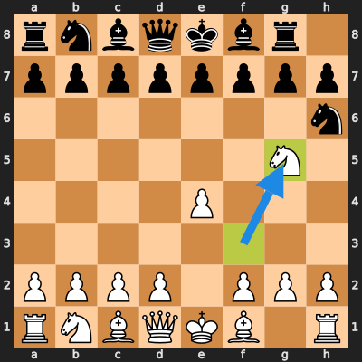

# GitChess ♟️ Git-driven Chess Engine

Welcome to **GitChess**, a chess game where every chess move is performed through Git commits and operations.

## Current Game State

<!-- BOARD_START -->


```
  a b c d e f g h
8 ♜ ♞ ♝ ♛ ♚ ♝ ♞ ♜ 8
7 ♟ ♟ ♟ ♟ ♟ ♟ ♟ ♟ 7
6 · · · · · · · · 6
5 · · · · ♙ · · · 5
4 · · · · · · · · 4
3 · · · · · · · · 3
2 ♙ ♙ ♙ ♙ · ♙ ♙ ♙ 2
1 ♖ ♘ ♗ ♕ ♔ ♗ ♘ ♖ 1
  a b c d e f g h

White to move
```
<!-- BOARD_END -->

## Quick Start

1. Install dependencies:
   ```bash
   pip install -e .
   ```
2. Initialize repository and Git hooks:
   ```bash
   git-chess init
   ```
3. Make moves using git commit messages or `git-chess move`:
   ```bash
   git commit --allow-empty -m "move: e2e4"
   ```
